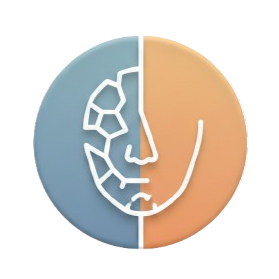
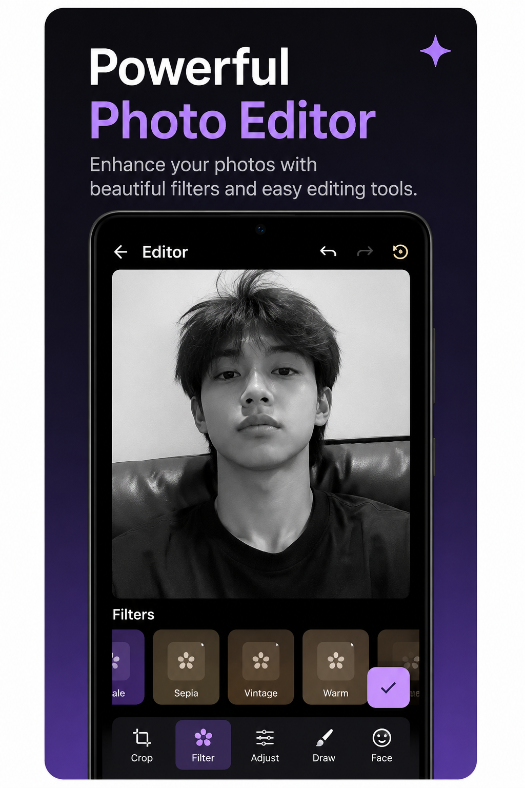
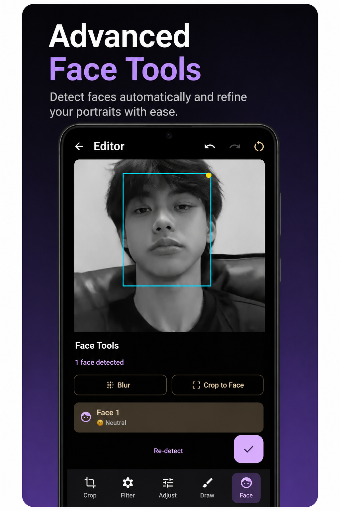
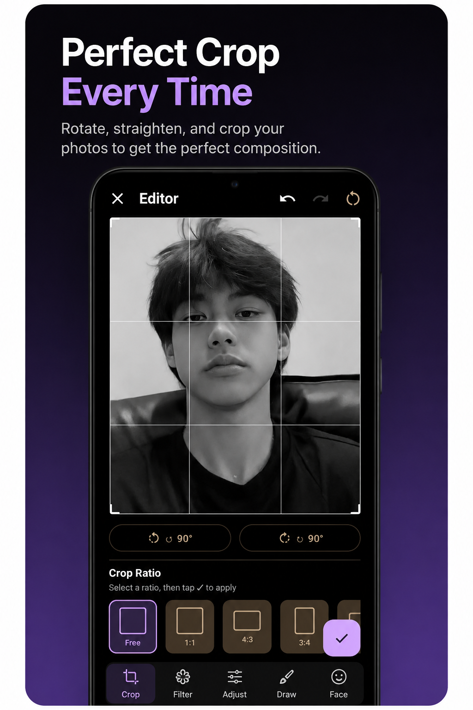
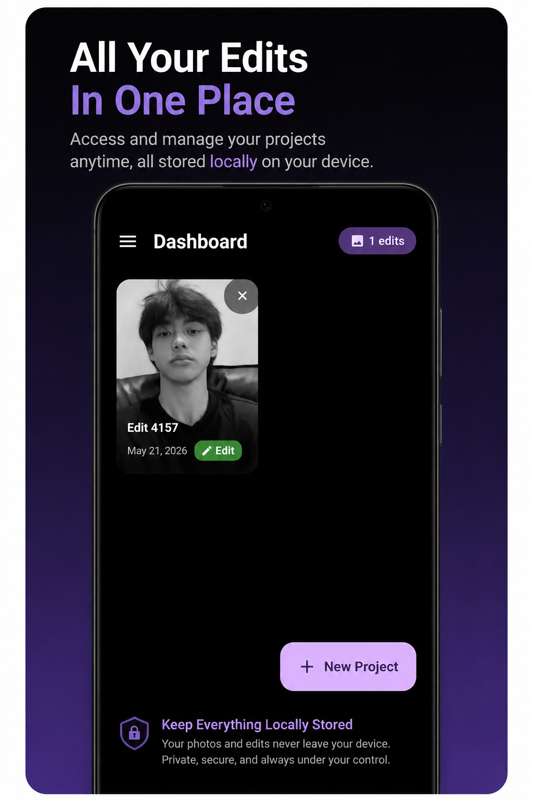

<p align="center">
  
</p>

<h1 align="center">FaceNox</h1>

<p align="center">
  A cross-platform image editor with face detection, filters, and background removal.
  <br/>
  Built with Kotlin Multiplatform + Compose Multiplatform.
</p>

<p align="center">
  <a href="https://github.com/Dev-Aditya-More/FaceNox/releases/latest">
    
  </a>
  
  
  
</p>

---

## Screenshots

<p align="center">
  
  
  
  
</p>

---

## Features

- **Face Detection** — automatically detect faces in any photo
- **Face Operations** — cut, blur, or crop to a detected face
- **Background Removal** — remove image backgrounds in one tap
- **Filters** — Grayscale, Sepia, Vintage, Warm, Cool, High Contrast
- **Adjustments** — brightness, contrast, and saturation sliders
- **Drawing** — annotate images with a freehand brush
- **Crop & Rotate** — precise crop tool with clockwise/counter-clockwise rotation
- **Undo / Redo** — full edit history so nothing is permanent
- **Export & Share** — save as PNG, JPEG, or WebP and share directly

---

## Download

| Platform | Link |
|---|---|
| Android (APK) | [GitHub Releases](https://github.com/Dev-Aditya-More/FaceNox/releases/latest) |
| Windows (MSI) | [GitHub Releases](https://github.com/Dev-Aditya-More/FaceNox/releases/latest) |
| Play Store | Closed Testing — [Request Access](https://github.com/Dev-Aditya-More/FaceNox/issues) |

---

## Tech Stack

| Layer | Technology |
|---|---|
| UI | Compose Multiplatform |
| Language | Kotlin Multiplatform |
| Architecture | MVI (ViewModel + State + Intent) |
| DI | Koin |
| Face Detection | ML Kit (Android) / Custom JVM (Desktop) |
| Navigation | Compose Navigation |

---

## Build from Source

**Prerequisites:** JDK 17+, Android SDK

```bash
# Clone the repo
git clone https://github.com/Dev-Aditya-More/FaceNox.git
cd FaceNox
```

**Android**
```bash
# Debug APK
./gradlew :androidApp:assembleDebug
# Output: androidApp/build/outputs/apk/debug/androidApp-debug.apk
```

**Desktop**
```bash
# Run directly
./gradlew :desktopApp:run

# Build Windows installer (.msi)
./gradlew :desktopApp:packageMsi
# Output: desktopApp/build/compose/binaries/main/msi/

# Build for macOS (.dmg) or Linux (.deb)
./gradlew :desktopApp:packageDmg
./gradlew :desktopApp:packageDeb
```

---

## Project Structure

```
FaceNox/
├── androidApp/      # Android entry point
├── desktopApp/      # Desktop (JVM) entry point
└── sharedUI/        # Shared Kotlin Multiplatform code
    ├── commonMain/  # Platform-agnostic UI and business logic
    ├── androidMain/ # Android-specific implementations
    └── jvmMain/     # Desktop-specific implementations
```

---

## License

This project is licensed under the MIT License. See [LICENSE](LICENSE) for details.
